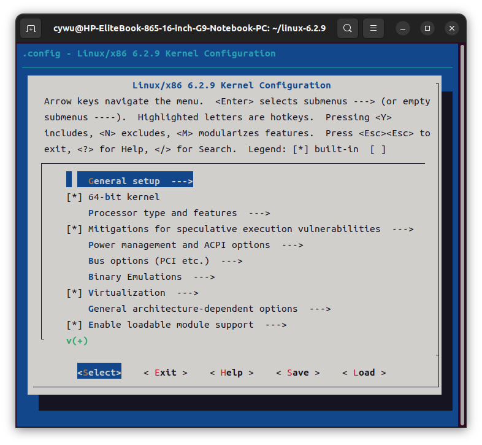
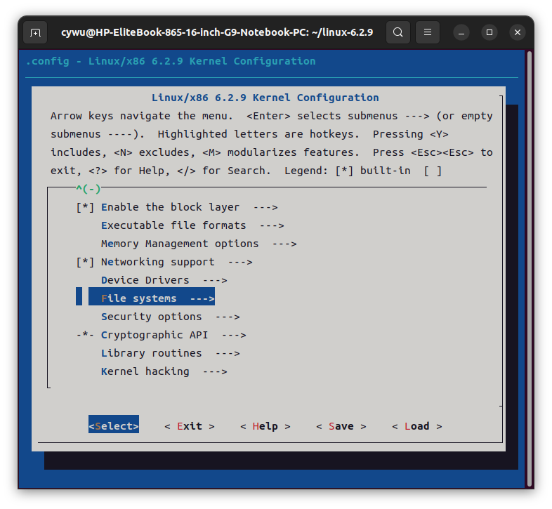
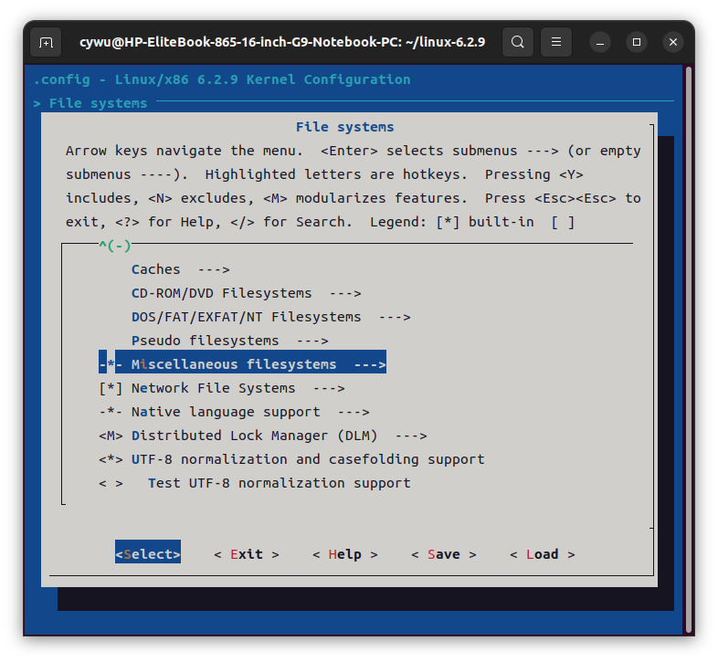
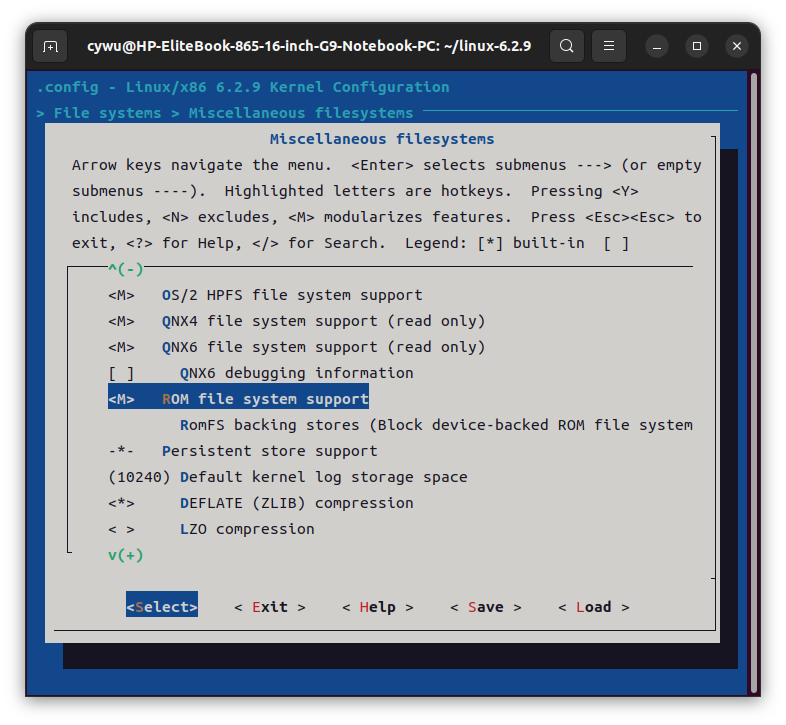

# CS3302 Project 4

## 实验内容

以Linux内核中的`fs/romfs`作为文件系统源码基础，修改并编译生成模块`romfs.ko`，实现以下功能：

* `romfs.ko`接受三个参数： `hidden_file_name`, `encrypted_file_name`和`exec_file_name`

  * `hidden_file_name=xxx`：需要被隐藏的文件路径

  * `encrypted_file_name=xxx`：需要被加密的文件路径

  * `exec_file_name=xxx`：需要修改权限为可执行的文件路径

通过`insmod romfs.ko`安装修改后的`romfs`模块，使用`genromfs`生成格式为`romfs`的镜像文件，使用`mount`命令挂载镜像文件并验证修改是否成功。

## 实验思路

```c
// fs/romfs/super.c
// 0.在合适的位置声明模块参数
// 1.实现隐藏文件功能
static int romfs_readdir(struct file *file, struct dir_context *ctx)
{
    // TODO: 如果文件名与要隐藏的文件名相同，则跳过该文件
}
// 2.实现加密文件的功能
static int romfs_read_folio(struct file *file, struct folio *folio)
{
    // TODO: (1) 获取文件名; (2) 如果文件名与目标相同，则修改文件内容
}
// 3.实现修改权限的功能
static struct dentry *romfs_lookup(struct inode *dir, struct dentry *dentry,
                                   unsigned int flags)
{
    // TODO: 如果文件名与目标相同，则修改文件的的权限为可执行
}
```

注：以上模板仅供参考，也可以完全按照⾃⼰的思路来实现

## 编译安装

**要求大家使用6.2.9版本的Linux内核**, 下载地址: [https://cdn.kernel.org/pub/linux/kernel/v6.x/linux-6.2.9.tar.xz](https://cdn.kernel.org/pub/linux/kernel/v6.x/linux-6.2.9.tar.xz)。本项目的`romfs`文件夹, 也完全来自于该版本的Linux内核。最终提交修改后的`fs/romfs/`模块文件夹即可。

在源码目录下`make menuconfig`, 按照下图依次选择：`File systems`→ `Miscellaneous filesystems`→`ROM file system support`, 将其设置为 `<M>` (modularizes features) 。









保存退出后，重新编译内核。编译完成后`romfs.ko`位于`fs/romfs`目录下。之后也可使用命令`make CONFIG_ROMFS_FS=m -C <path to linux source code> M=<path to linux source code>/fs/romfs modules`单独编译模块。

## 安装及测试

`GitHub`仓库中提供了`test.img`，镜像中包括`aa`, `bb`和`cc`三个文件， `bb`中的内容为 `abcdefg`, `cc`的执行结果会输出 `pass`。

```bash
# 安装模块
insmod romfs.ko hidden_file_name=aa encrypted_file_name=bb exec_file_name=cc
# 创建临时目录asdf
mkdir -p asdf
# 挂载镜像到临时目录asdf下
mount -o loop -t romfs test.img asdf
# 查看asdf目录下的文件 发现aa文件不存在
ls -al asdf
# 查看bb内容，应该输出加密后的内容
cat asdf/bb
# 输出pass
asdf/cc
```

## 实验提示
1. `romfs`的主要功能都在`fs/romfs/super.c`中实现，在该文件中通过`module_param`接收参数

2. 阅读`super.c`， `romfs`是如何查找目录下的文件的？如果想要隐藏一个文件，那么在函数中，当我们发现某个文件名是我们想要隐藏的文件，要如何修改使得系统“忽略”该文件？

3. `romfs`是通过哪一个函数来读取某一个文件的具体内容？如何从文件的`inode`获取文件名？文件的内容被读取到哪里？通过对buffer内容修改进行加密操作。（注意这里加密只是一个概念性操作，采用简单的古典加密方法即可）

4. 文件的权限信息在`inode`中存储，我们需要在哪个函数中去修改文件的权限信息呢？

5. `kmap`：建立物理页的虚拟地址的映射

## 实验提交

提交渠道：Canvas

提交⽂件：`学号_project4.zip`，源码⽂件夹 `学号_project4_src`（所有源代码文件以及Makefile），实验报告 `学号_project4_report.pdf`。

实验报告内容包括但不限于实验过程、实验效果截图、实验心得（实验过程中遇到的困难、解决的方法，或者是值得分享的小技巧）。


